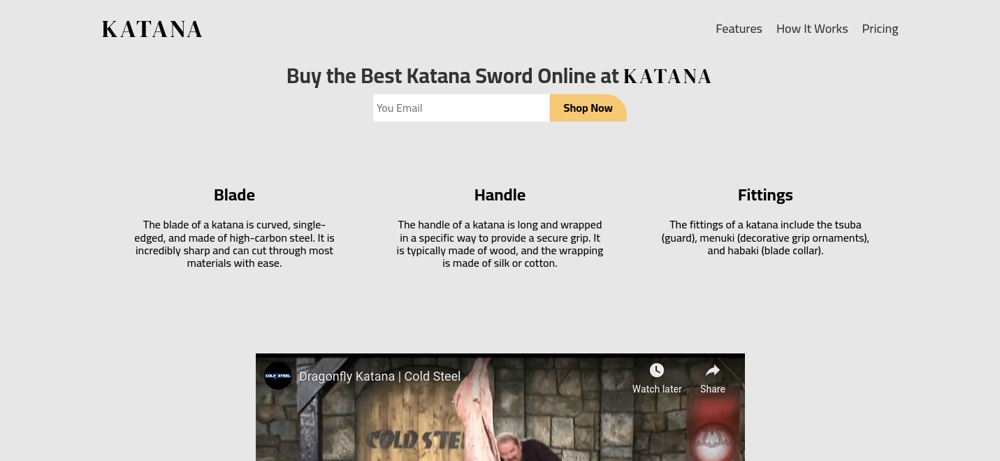

# Build a Product Landing Page in freecodecamp

This is a solution to the Build a Product Landing Page for Certifications of Responsive Web Design.

## Table of contents

- [Overview](#overview)
  - [The challenge](#the-challenge)
  - [Links](#links)
- [My process](#my-process)
  - [Built with](#built-with)
  - [Continued development](#continued-development)
- [Author](#author)

## Overview

### The challenge

Users should be able to:

- View the optimal layout depending on their device's screen size

### Links

- Solution URL: [Solution URL here](https://github.com/cd-wb/ProductLanding)
- Live Site URL: [Live site URL here](https://cd-wb.github.io/ProductLanding)

## My process

### Built with

- Semantic HTML5 markup
- CSS custom properties
- Flexbox
- CSS Grid

### Continued development

I want to focus on the flexbox and grid in future projects because they help me to simplify my website and also to create responsive layouts. One of the great things about Flexbox is the way it handles the distribution of space within a container.

## Author

- Frontend Mentor - [@Abdessamad](https://www.frontendmentor.io/profile/kop-left)
- github - [@Abdessamad](https://www.twitter.com/cd-wb)
